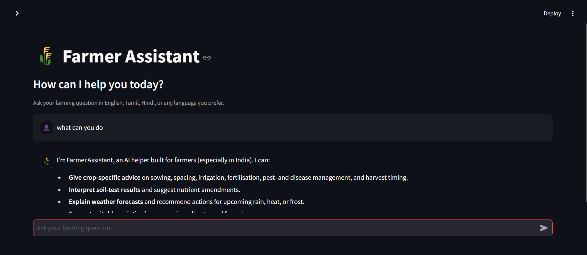
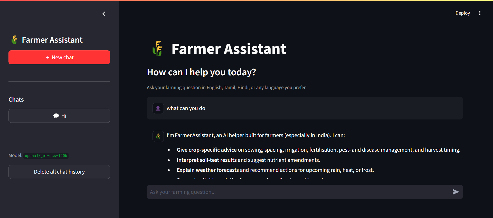

# 🌾 Farmer Assistant

**Farmer Assistant** is a multilingual AI assistant that helps farmers get practical, easy-to-understand answers using an LLM and web search for information that may require fresh external data.

> **Current version:** LLM + web-search augmentation. A proper RAG/Agentic RAG architecture is planned for a future version.

## 🚀 Live Demo

👉 **[Try Farmer Assistant](https://farmer-assistantv1.streamlit.app/)**

Experience the multilingual AI assistant and test its web-search capabilities directly in your browser.

## ✨ Features

- 🤖 LLM-powered agricultural assistant
- 🌐 Web search for current or external information
- 🗣️ Responds in the language used by the user
- 💬 Streamlit chat interface
- 🕘 Local conversation history with multiple chats
- 🔐 API configuration through environment variables
- 🛡️ Public app does not expose shell, SSH, Python REPL, or browser-login tools

## 🧠 Workflow

```text
User Question
     │
     ▼
Need fresh information?
   │          │
  Yes         No
   │          │
   ▼          │
Web Search   │
   │          │
   └────┬─────┘
        ▼
     Groq LLM
        │
        ▼
   Final Answer
```

Web search is triggered only when the question contains signals such as current/latest prices, weather, market rates, schemes, or recent information.

---

## 🖥️ Screenshots

### 💬 Chat Interface



### 🆕 New Chat & Chat History



---
## 🛠️ Tech Stack

- **Python**
- **Streamlit**
- **Groq API**
- **Phidata**
- **DuckDuckGo Search**
- **python-dotenv**

## 🚀 Run Locally

### 1. Clone

```bash
git clone <YOUR_GITHUB_REPOSITORY_URL>
cd Farmer-Assistant
```

### 2. Create a virtual environment

**Windows PowerShell**
```powershell
python -m venv .venv
.\.venv\Scripts\activate
```

**macOS/Linux**
```bash
python3 -m venv .venv
source .venv/bin/activate
```

### 3. Install dependencies

```bash
python -m pip install --upgrade pip
pip install -r requirements.txt
```

### 4. Configure `.env`

Copy `.env.example` to `.env` and add:

```env
GROQ_API_KEY=your_key_here
GROQ_MODEL=openai/gpt-oss-120b
```

Never commit `.env` or real credentials.

### 5. Start

```bash
streamlit run app.py
```

## 📁 Project Structure

```text
Farmer-Assistant/
├── app.py
├── MainAgent.py
├── BrowserTool.py
├── ImageAPI.py
├── requirements.txt
├── .env.example
├── .gitignore
├── README.md
└── data/
    └── .gitkeep
```

The repository also contains legacy prototype files that are not enabled by the public Streamlit application.


## 🔮 Roadmap

```text
Current: LLM + Web Search
        ↓
Proper RAG
        ↓
Structured Outputs
        ↓
Tool Calling
        ↓
Agent Workflows
        ↓
Memory / State
        ↓
Evaluation + Observability
        ↓
Production Deployment
```

## ⚠️ Disclaimer

This is an educational AI project. Agricultural recommendations can depend on crop variety, soil, weather, local conditions, regulations, and other factors. Verify high-risk decisions with qualified agricultural professionals or authoritative local sources.

## 👨‍💻 Author

**Mithilesh A**

Software Developer

---

⭐ If you find Farmer-assitant useful, consider giving the repository a star.


